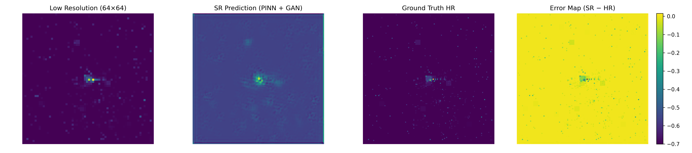

# Physics-Informed GANs for Super-Resolution of Calorimeter Jet Images with Uncertainty Estimation

This project focuses on reconstructing high-resolution (125×125) calorimeter jet images from low-resolution inputs using a hybrid deep learning framework that combines **Generative Adversarial Networks (GANs)** and **Physics-Informed Neural Networks (PINNs)**.

The goal is to produce reconstructions that are not only visually accurate but also **physically consistent and scientifically meaningful**.


## Problem Statement

Calorimeter jet images represent energy deposits from particle collisions (e.g., quarks and gluons).  
Standard super-resolution models optimize pixel-wise similarity but often fail to preserve key physical properties such as:

- Total energy conservation  
- Spatial energy distribution  
- Jet structure integrity  


## Approach

### 1. Baseline Model

A standard super-resolution CNN trained using pixel-wise loss (MSE / L1).

- Serves as a reference benchmark  
- Optimizes reconstruction accuracy but ignores physical constraints  


### 2. GAN + PINN Model (Proposed)

A hybrid framework that combines:

- **GAN (SRGAN-style)** → improves perceptual quality and sharpness  
- **PINN constraints** → enforce physical consistency  

This allows the model to balance:

- **Visual realism** (GAN)
- **Physical correctness** (energy + structure preservation)


## Model Design

- **Generator:**  
  CNN with residual connections to preserve low-frequency structure and reconstruct high-frequency details  

- **Discriminator:**  
  CNN-based classifier distinguishing real vs generated images  

- **Loss Function:**
_**L_total = L_pixel + 0.1 L_adv + 0.1 L_energy + 0.05 L_centroid**_


Where:

- `L_pixel` → reconstruction loss (L1 / MSE)  
- `L_adv` → adversarial loss  
- `L_energy` → enforces total energy conservation  
- `L_centroid` → preserves spatial energy distribution  


## Training Strategy

Training is performed in stages:

1. **Baseline Training**  
   Learn stable LR → HR mapping using pixel loss  

2. **Physics-Informed Fine-Tuning**  
   Introduce energy and centroid constraints  

3. **GAN Refinement**  
   Add adversarial training for sharper outputs  

This staged approach improves stability and interpretability.


## Results

### GAN + PINN Output



## Observations

- The model successfully reconstructs the **central high-energy jet region**  
- PINN constraints significantly improve **energy consistency**  
- GAN enhances **spatial detail and sharpness**  
- Errors are concentrated in **low-intensity regions**, while core structure is preserved  

> The model prioritizes **physical fidelity over pixel-wise similarity**, which is critical in scientific applications.


## Limitations

- Slight blurring due to dominance of reconstruction + physics losses  
- GAN not fully utilized for high-frequency detail generation  
- Loss balancing remains a key challenge  


## Future Work

- Improve adversarial training stability  
- Incorporate **perceptual loss (VGG-based)** for sharper outputs  
- Add **Uncertainty Quantification (UQ)**:
  - Monte Carlo Dropout  
  - Deep Ensembles  
- Evaluate **uncertainty vs reconstruction error correlation**  

This will enable the model to **identify its own failure regions**, improving reliability in scientific workflows.


## How to Run

```bash
pip install -r requirements.txt
